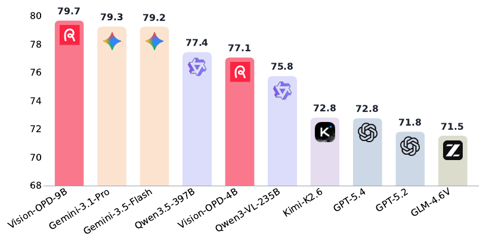
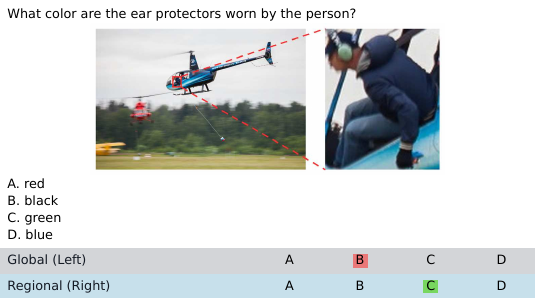
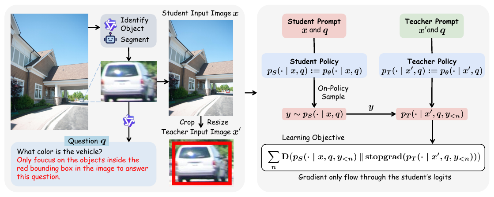
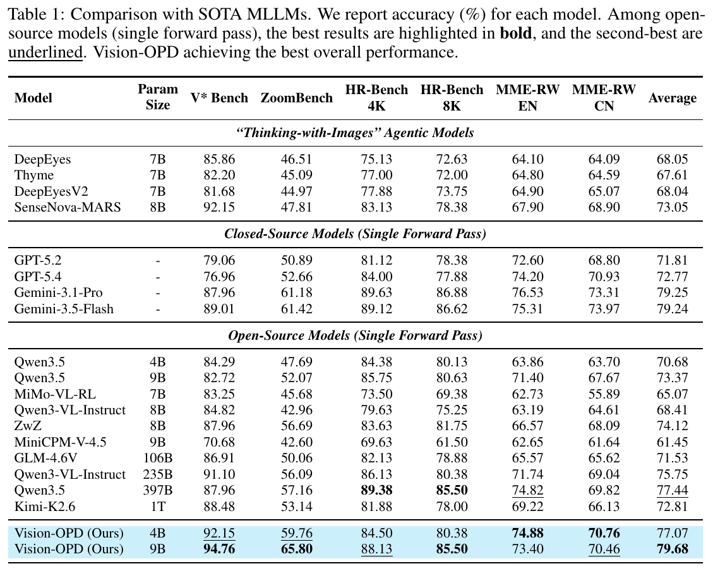

# Vision-OPD：用在线自蒸馏，让多模态模型学会"看清细节"

> **论文：https://arxiv.org/abs/2605.18740**
> **代码：https://github.com/VisionOPD/Vision-OPD**

*图 1：在 V\* Bench、ZoomBench、HR-Bench 4K、HR-Bench 8K、MME-RealWorld-EN、MME-RealWorld-CN 上的平均分。Vision-OPD-9B 以 79.7 总体第一，Vision-OPD-4B 也达 77.1。*

---

## 动机

多模态大模型（MLLM）如今在通用看图说话上已经相当能打，但只要问题的答案藏在图里**一小块决定性的细节**上，它们就常常翻车——给出一个"看着挺像、其实答错"的回答。

我们注意到一个反复出现的现象：**同一个模型，把"对准关键证据、裁剪放大后的局部图"喂给它，回答细粒度问题的准确率，明显高于喂完整大图。** 也就是说，模型并不是"认不出"这个细节，而是当细节淹没在整张图的海量视觉 token 里时，它**没法把注意力盯到真正相关的证据上**。我们把这道坎叫作**区域到全局的感知鸿沟（regional-to-global gap）**。

先直观感受一下这道鸿沟。

以 Qwen3.5-9B 为例，问它「图中人物戴的护耳是什么颜色？」（如下图）：

*图 2：一个区域到全局鸿沟的例子（基于 Qwen3.5-9B）。全图输入导致答错，而裁剪区域输入则得出正确答案。*

- **给完整大图**：模型被全局场景带偏，答"黑色"——错；
- **只给裁剪放大后的关键区域**：决定性证据被凸显出来，模型答"绿色"——对。

最近流行的 "Thinking-with-Images"（边想边看）给模型配上裁剪、放大的视觉工具，让它在推理时主动去抠局部，确实有效，但代价是反复编码图像、反复调用模型，**推理开销大幅增加**。

于是问题就来了：

> **能不能把"放大关键区域、让证据从背景里凸显出来"这个好处，通过训练直接内化进模型，让它一次前向传播就能从整图里用上细粒度证据，而不必在推理时动用任何工具？**

换句话说，我们想要的，是把这种"放大聚焦"的本事**训练进模型权重**，让它在一次前向传播里自然发生。

---

## 介绍

既然模型看局部一向比看全局强，那么它看裁剪图时的表现，就是一份**现成的、可以拿来提升全图表现的特权监督信号**——用前者去教后者，把"放大"的收益内化成单次前向传播的能力。

*图 4：Vision-OPD 总览。左：在包含关键证据的裁剪图上生成细粒度问题。右：学生在线采样轨迹 y，沿轨迹计算老师与学生的逐 token 散度，梯度只回传给学生，实现无标签的自蒸馏。*

由此，我们提出 **Vision-OPD（Vision On-Policy Distillation）**，一个面向细粒度视觉理解的**区域到全局在线自蒸馏框架**。它的精髓在于，从**同一个模型**里派生出两个"视角不同"的策略：

- **裁剪老师（Teacher）**：只看那块对准了关键证据的裁剪放大图，这是它的**特权视角**；
- **全图学生（Student）**：看完整大图。

学生先在全图上**自己生成**回答轨迹（在线采样）；对学生写下的每一段前缀，Vision-OPD 分别算出裁剪老师和全图学生的 logits 分布，再把两者的散度压到最小。这样一来，模型就在学生自己的生成轨迹上，把老师的特权裁剪行为**迁移**给了全图策略——全程**不用外部老师、不用真值标签、不用奖励验证器、推理时也不用任何工具**。

我们的贡献可以归纳为三点：

- 提出**区域到全局的自蒸馏思路**：把特权的裁剪条件行为，当作全图推理的监督信号。
- 提出 **Vision-OPD** 框架：让裁剪策略在学生的在线轨迹上，通过 token 级监督来指导全图策略。
- 用实验验证其有效性：它能**显著缩小区域到全局鸿沟**，并证明**在线采样**和**稠密 token 级监督**是成功的关键。

---

## 方法

### 训练框架

Vision-OPD 从同一个模型派生出两个只在"看什么"上不同的策略：老师看裁剪放大图 `x'`，学生看完整图像 `x`，两者从同一模型初始化。在干净的局部视角下，老师能给学生提供一份"自带放大镜、却不必额外解码"的指导。

训练时，对每个样本 `(x, x', q)`：

1. 学生看着全图 `x` 和问题 `q`，**自己生成**一条回答轨迹 `y`；
2. 对 `y` 的每个位置，学生（看全图）和老师（看裁剪图）在**相同前缀**下各给出下一 token 的分布；
3. 把两者在 token 级别上的散度压到最小；
4. 梯度**只回传给学生**，老师作为固定目标（stop-gradient）。

因为训练前缀就是学生自己生成的序列，训练和推理的状态分布对得上，避开了离线蒸馏里"前缀对不上、误差越滚越大"的毛病；又因为每个 token 都拿到有意义的梯度，哪怕一批样本恰好全对或全错，训练也不会停摆。

### 数据合成

我们用一条**全自动**流水线，从无标注图像里造出三元组 `(x, x', q)`，总共合成约 **6.2K** 条：

- 对原图做物体识别和分割，挑出**面积占比很小**（最可能藏着细粒度证据）的区域 `R`；
- 让模型给每个区域生成一个"**光看这块就能答**"的问题 `q`；
- 把区域的边界框**叠回原图**，再加一句空间约束（比如"只关注红框里的物体"），得到学生输入 `x`；
- 把这块区域裁剪、放大 **2×**，得到老师输入 `x'`。

同一个问题，在两种视角下各问一遍，两者的差距就是自蒸馏要学的信号。

### 关键设计

- **散度目标函数**：用广义 Jensen–Shannon 散度 **JSD(β=0.5)**，效果好过纯前向 KL 和反向 KL。
- **Top-K logits 蒸馏 (K=100)**：只蒸馏 top-100 的 logits，再补一个尾概率项，既省下全词表蒸馏的高显存，又留住了绝大部分 logits 信息。
- **老师用 EMA 正则(α=0.05)**：老师和学生从同一模型出发、随训练更新；要是直接拿当前策略当老师，训练会**整体崩盘**（准确率掉到接近 0），EMA 正则更稳。

到这一步，Vision-OPD 同时满足五个条件：**在线采样、稠密 token 级监督、不用外部老师、不用真值标签、不用验证器**。又因为裁剪图 `x'` 是从无标注图像里全自动抽出来的，这套方法能适配任意图像语料，把细粒度视觉理解直接内化进一次前向传播。

---

## 实验

我们把 Vision-OPD 用在 Qwen3.5-4B/9B 上，在 **V\* Bench、ZoomBench、HR-Bench 4K/8K、MME-RealWorld(EN/CN)** 等细粒度视觉理解基准上评测。

*表 1：与 SOTA 多模态模型的对比（准确率 %）。涵盖 "Thinking-with-Images" 智能体方法、闭源模型、开源模型三组；Vision-OPD 取得最佳总体性能。*

**Vision-OPD-9B 拿下 79.68 的平均分，在所有对比模型中总体第一**：

- 超过闭源的 **Gemini-3.1-Pro（79.25）**、**Gemini-3.5-Flash（79.24）**；
- 超过体量大得多的开源模型，比如 **Qwen3.5（397B，77.44）**；
- 也超过各类 **"Thinking-with-Images" 智能体方法**，而 Vision-OPD 只需**一次前向传播**。

**Vision-OPD-4B 的平均分也有 77.07**，说明 Vision-OPD 确实能把细粒度视觉理解的本事，有效地"装"进现有模型里。

更难得的是它**专精却不偏科**：在训练分布之外的基准（MMVP、CV-Bench、MMStar、POPE）上，它**保持甚至提升**了通用的看图与推理能力，没有出现专项微调常见的"学了新的、忘了旧的"。换句话说，这份提升**不是拿遗忘换来的**。

---

## 总结

我们提出了 **Vision-OPD**——一个面向细粒度视觉理解的区域到全局在线自蒸馏框架。它背后的洞见很简单：大模型的细粒度瓶颈，往往**不在"认不认得"，而在"盯不盯得住"**；而模型自己在裁剪条件下的特权感知，恰好可以拿来监督它的全图行为。Vision-OPD 从同一个模型派生出裁剪老师和全图学生，在学生的在线轨迹上做 token 级自蒸馏，**不用更强的外部老师、不用真值标签、不用奖励验证器，推理时也不用任何工具**。仅凭约 6.2K 条全自动合成数据，它就让一个 9B 模型在多个细粒度视觉理解基准上，打平甚至超过了闭源模型、更大的开源模型和 "Thinking-with-Images" 智能体方法，同时不丢通用能力。
